# hse_hw2_chip
В данном практическом задании вы научитесь определять участки генома, где присутствует определенная гистоновая модификация в конкретном типе клеток с помощью анализа ChIP-Seq данных.
## [Google Colab link](https://colab.research.google.com/drive/1duVTtPtYxVa_Alkp62uzowUPBcbpUHEI?usp=sharing)
## Quality control
Raw reads | Trimmed reads
-|-
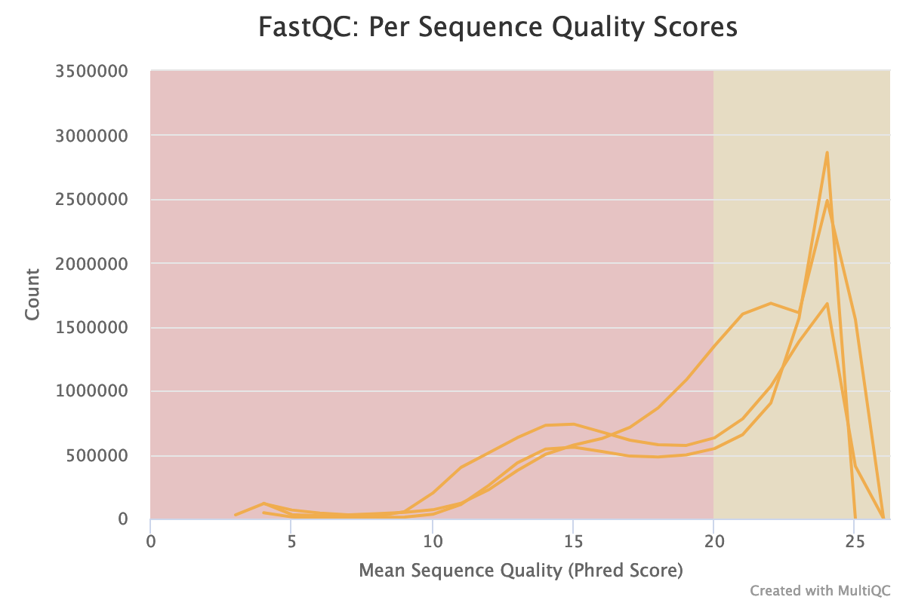 | 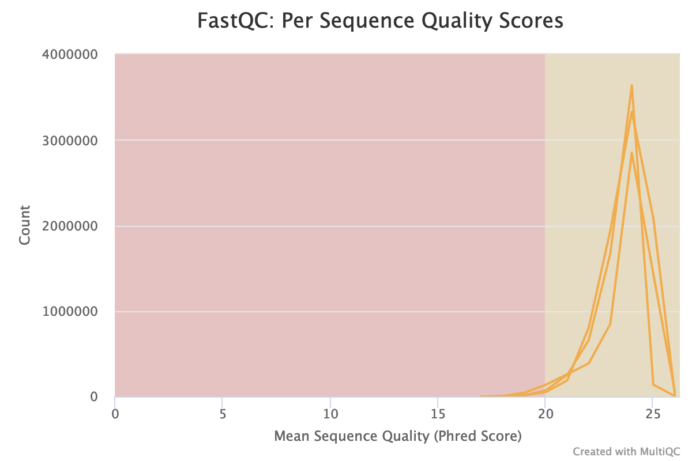
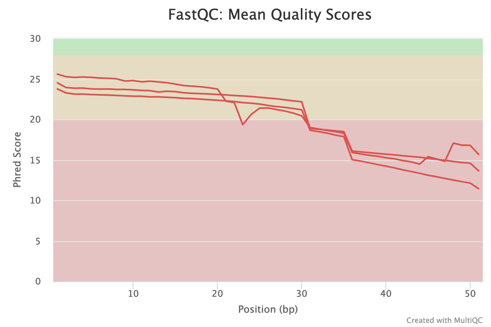 | 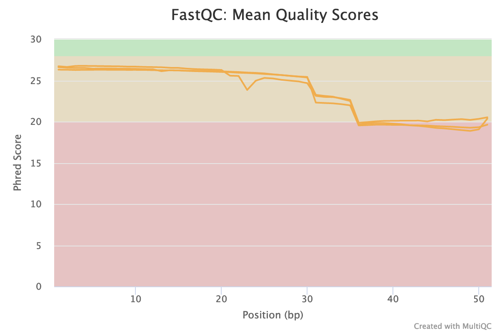
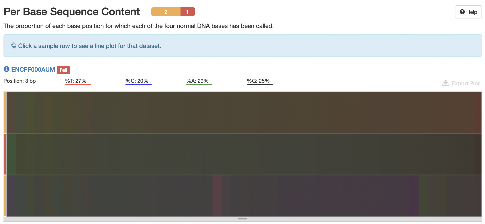 | 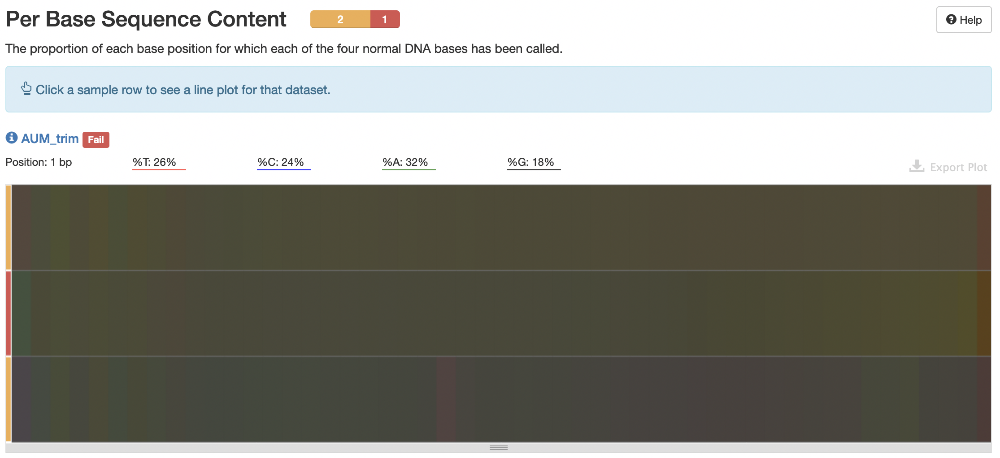
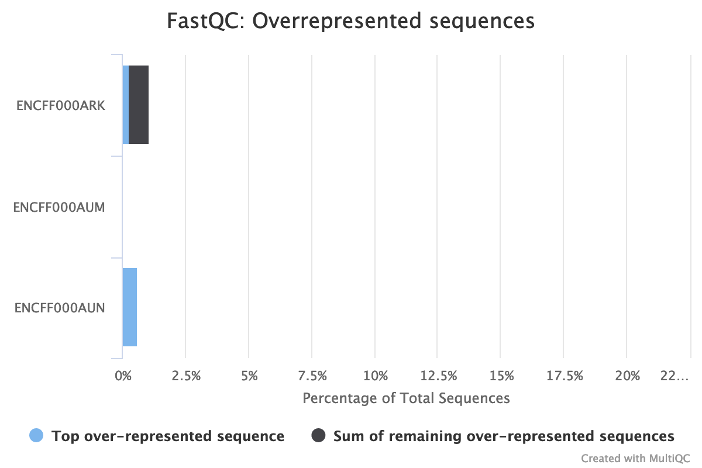 | 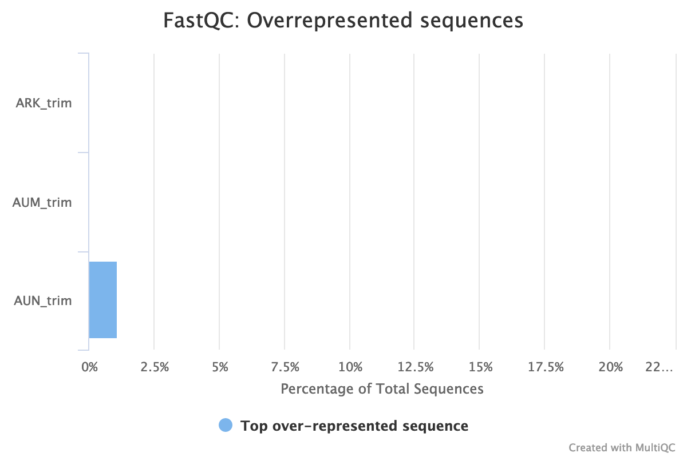
## Results of mapping reads on the chromosome 14
Sample ID | Reads analyzed | Aligned 0 times | Aligned exactly 1 time | aligned >1 times
 --- |--- |--- |--- |---
ENCFF000AUN | 4354613 (100.00%) | 3728554 (85.62%) | 177764 (4.08%) | 448295 (10.29%)
ENCFF000AUM | 4354613 (100.00%) | 3669612 (84.27%) | 183916 (4.22%) | 501085 (11.51%)
ENCFF000ARK | 6251047 (100.00%) | 5058249 (80.92%) | 276089 (4.42%) | 916709 (14.66%)

Во всех трёх образцах большая часть чтений не выровнялась на хромосому - процент уникальных выравниваний варьируется в пределах 4.08-4.42%. Такой низкий процент картирования объясняется тем, что исследуемые чтения были получены в результате секвенирование целого генома, а мы выравниваем их только на 14-тую хромосому, длина которой составляет лишь 3-3.5% от длины всего генома человека.

Не уникальных выравниваний в два раза больше, чем уникальных для первого образца, и примерно в три раза больше для второго и контрольного образца. Одно и то же чтение может выровняться одинаково хорошо на несколько участков генома как по биологическим, так и чисто техническим причинам. Примером биологической причины являются повторы, которые в больших количествах встречаются в геноме человека. Технические причины связаны сомнительным качеством чтений. В нашем случае чтения далеко не лучшего качества по нескольким параметрам, например, распределение длин последовательностей вызывает вопросы: чтения заметно разняться в длине, присутствует много коротких чтений, длиной 35-40.

Стоит ли для дальнейшего анализа отобрать только уникально выровненные чтения? Я считаю, что прежде, чем принять такое решение, следует разобраться в причинах имеющихся повторных картирований. Не уникальные чтения, полученные исключительно по техническим причинам, стоит убрать.
## Comparing our results with the published results
### Replicate 1 (ENCFF000AUN)
Our peaks in published | Published peaks in ours
-|-
 | 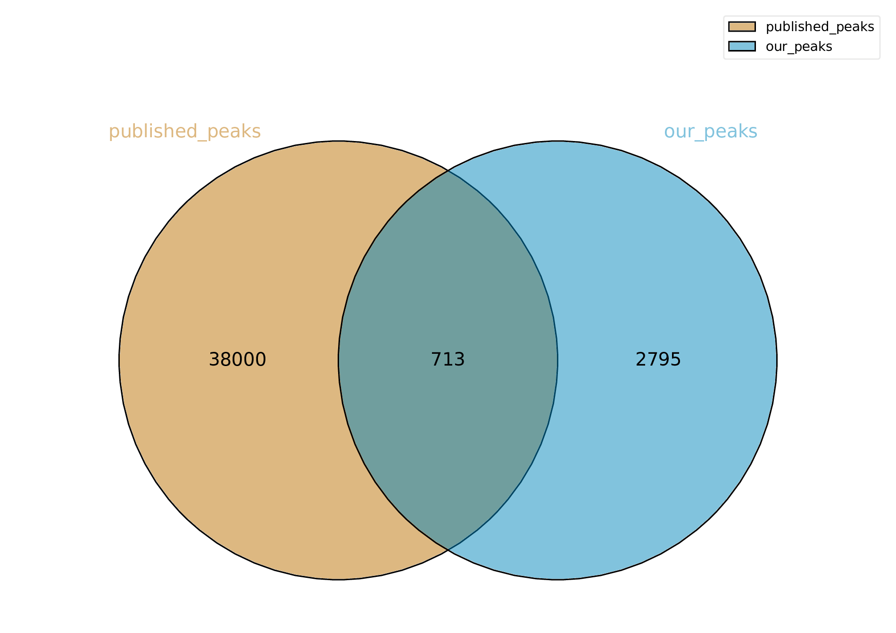
### Replicate 2 (ENCFF000AUM)
Our peaks in published | Published peaks in ours
-|-
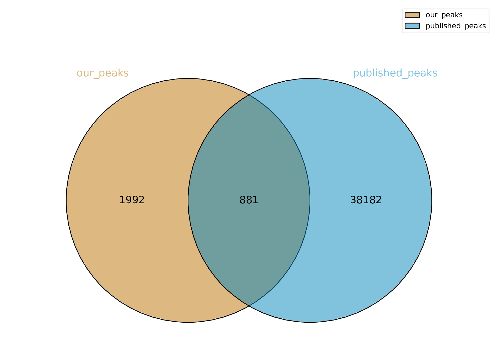 | 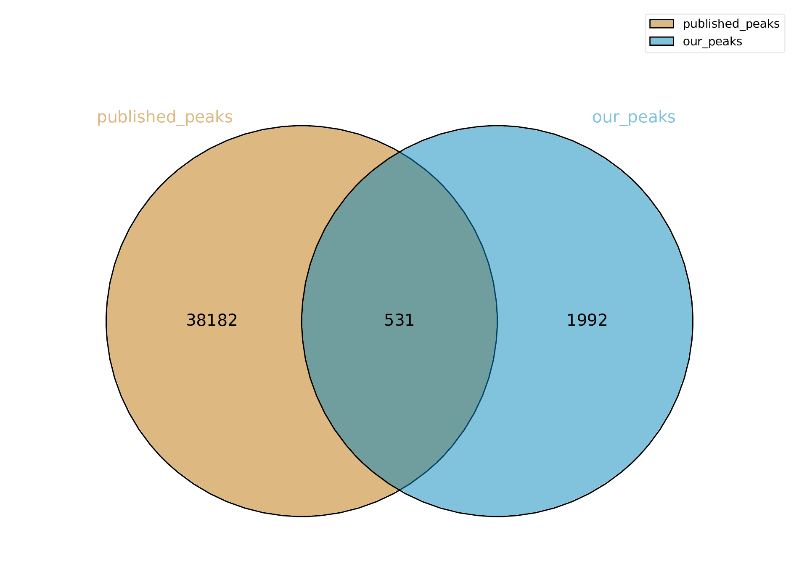
### Conclusions
Первое, что обращает на себя внимание - далеко не все пики, найденные мной на 14-ой хромосоме, входят во множество пиков, найденных во всем геноме исследователями, как можно было бы ожидать. Возможно, это связано с тем, что я не удалил не уникальные картирования, а ученые это сделали. Другое возможное объяснение: ученые намного серьезнее подошли к очистке данных и удалили большую часть некачественных чтений в отличие от меня.

Вторая интересная деталь заключается в том, что количество пиков в пересечении двух множеств на диаграммах Венна зависит от порядка подачи аргументов на вход программе. Это связано с тем, что программа считает количество участков из первого файла (аргумента), которые пересекаются с участками из второго файла (аргумента). Для обоих образцов большее количество пересечений получилось при поиске найденных мной пиков в файле, опубликованном в ENCODE, а не наоборот. Проанализировав некоторое количество записей из файлов с пиками, я пришел к выводу, что этот факт может быть связан с тем, что пики, найденные мной, в среднем короче, чем пики в файле с сайта, следовательно могут быть случаи, когда несколько моих пиков попадают в один пик исследователей.
